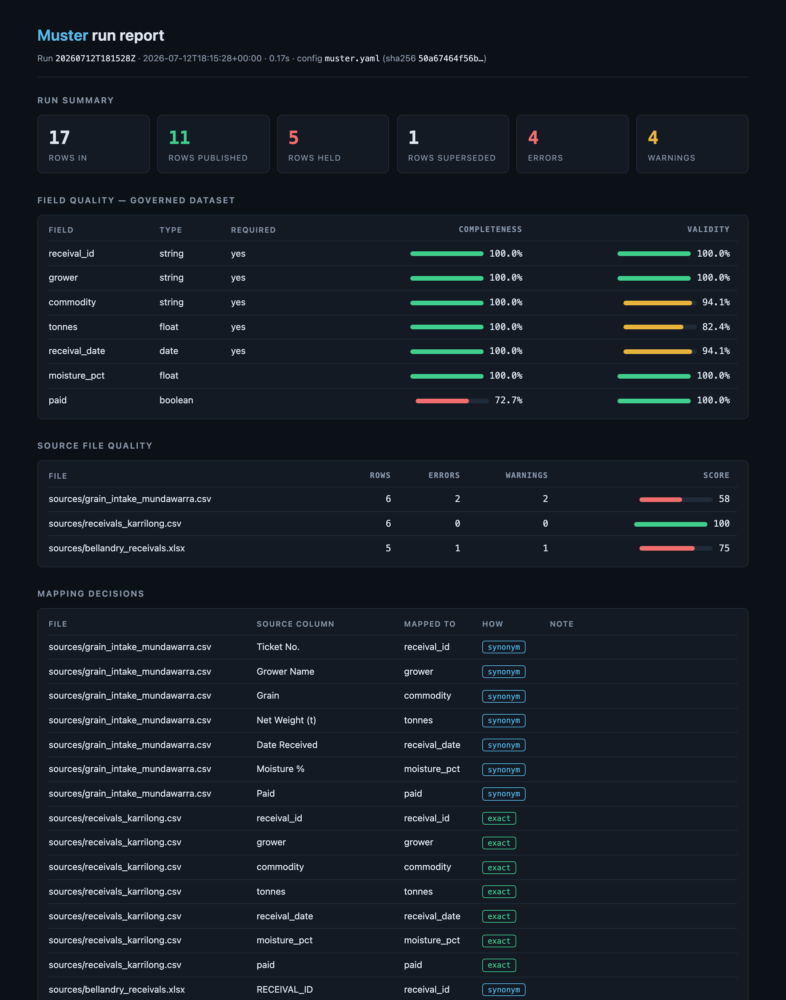

# Muster

Muster consolidates inconsistent spreadsheets into one governed dataset.

## The problem

Plenty of critical processes — month-end reporting, grower payments, stock
reconciliation, customer master data — run on spreadsheets collected from
people who never agreed on a format. The same column is `Cust ID` in one
file, `customer_number` in another and `Client #` in a third; dates arrive
as `03/05/2024`, `2024-05-03` and `5 Mar 24` in the same folder; the same
record appears in two files with different values. Someone consolidates it
all by hand, or with a script that silently coerces whatever it cannot
parse, and the numbers that come out cannot be traced back to what went in.

Muster is built from those pain points, seen repeatedly across client
engagements. Point it at the folder and it maps every column onto a
canonical schema you define, coerces values to declared types, validates
every row against your rules, reconciles duplicate keys across files, and
publishes a single governed dataset — with a written record of everything
it could not handle and everything it did.

## The philosophy

- **Never guess silently.** A heading that fuzzy matching cannot place, a
  cell that will not parse as its declared type, two files that disagree
  about the same record — each becomes a row in `exceptions.csv` with the
  file, row, column, value and reason. No data is dropped, coerced or
  merged without a written exception.
- **Exceptions go to humans.** The exceptions file and the dashboard's
  exceptions browser are a work queue for people, not a log to ignore.
  Errors hold rows out of the governed dataset until someone acts;
  resolutions append to an audit log and never rewrite history. A held row
  can be corrected — in the browser or with `muster resolve` — and rejoins
  the governed dataset on the next run only after re-validating against
  the full rule set, with the decision recorded in the manifest chain.
- **Configuration is confirmed, not assumed.** `muster init --from` will
  propose a schema from your real files, but every inference is marked
  `PROPOSED` and Muster refuses to run until a person has reviewed and
  accepted it. The same rule applies to LLM-assisted column mapping:
  proposals sit inert until accepted, one by one.
- **An integrity chain over every run.** Each run and each publish appends
  a manifest recording SHA-256 digests of the configuration, inputs and
  outputs, chained to the manifest before it. Where a number came from —
  and where it was sent — can be checked, not merely trusted.

## Quickstart

Requires Python 3.11 or later.

```sh
git clone https://github.com/pcguest/muster && cd muster
pipx install .
muster demo
cd demo
muster serve
```

(PyPI publication is pending; until then, install from a clone.)

`muster demo` writes three deliberately disagreeing, entirely synthetic
grain-receival spreadsheets and runs the whole pipeline over them. It also
populates a local SQLite publish outcome, a mapping-review fixture and a
weekday schedule so `cd demo && muster serve` opens the complete interface,
not a shell of empty panels. Then, on your own files:

```sh
muster profile sources/       # inspect columns, types, inconsistencies
muster init --from sources/   # propose muster.yaml from the files
muster confirm                # accept the proposals you have reviewed
muster run                    # consolidate, validate, reconcile
muster serve                  # dashboard: runs, trends, exceptions, review
```

[docs/WORKFLOW.md](docs/WORKFLOW.md) walks the whole workflow as a
narrative; `muster --help` lists every command.

## Features

| Feature | What it does |
|---|---|
| Profiling | `muster profile` reports each file's columns, inferred types and format inconsistencies before you configure anything |
| Config generation | `muster init --from` proposes a schema from real files; every inference marked `PROPOSED` and refused until reviewed ([docs/CONFIG.md](docs/CONFIG.md)) |
| Column mapping | Exact match, declared synonyms, then case/punctuation-insensitive fuzzy matching with a configurable threshold; ambiguity is an exception, not a guess |
| Strict coercion | Values coerced to declared types (string, integer, float, boolean, date, datetime) with per-cell failure capture |
| Validation | Range, regex and allowed-values rules per field, structured cross-field comparisons, at error or warning severity |
| Reconciliation | Duplicate keys merged when they agree, held with a conflict exception when they do not — unless survivorship is explicitly configured |
| Exceptions | Everything unhandled lands in `exceptions.csv` with file, row, column, value, reason and severity |
| Report | Self-contained `report.html` per run: completeness, validity, per-file quality, mapping decisions, exceptions — readable by non-technical reviewers |
| Audit trail | Tamper-evident hash chain of manifests over every run and publish |
| Publishing | `muster publish` to SQLite, PostgreSQL, REST endpoints or Salesforce, with dry-run, integrity checks and idempotent writes ([docs/CONNECTORS.md](docs/CONNECTORS.md)) |
| Dashboard | `muster serve`: local-first, token-authenticated browser UI for runs, trends, exception triage and remediation, mapping review, publishing status, automation and the report |
| Scheduling | `muster schedule` + `muster daemon`, or generated systemd/cron units |
| LLM assist (opt-in) | Proposes mappings for unmapped columns; sends only headings, types and redacted samples; nothing applies without human acceptance |
| Performance | 5 million rows consolidated and validated in under nine seconds on a laptop ([docs/PERFORMANCE.md](docs/PERFORMANCE.md)) |
| Security | Untrusted-input handling, secret redaction, hardened local web UI — threat model in [docs/SECURITY.md](docs/SECURITY.md) |

## The report

Every run writes one self-contained HTML file — no external requests, no
scripts — for the person who owns the data, not just the person who ran
the tool:



## The dashboard

`muster serve` is the operating surface for an existing Muster project. One
consistent navigation bar connects the latest run and field quality,
exceptions, remediation status, mapping review, trends, configured publish
targets and their last manifest outcome, schedule/daemon status, and the full
run report. It is server-rendered and keyboard-operable, with no JavaScript,
CDNs or external requests. Every page has an explicit fresh-project, clean or
unavailable state; a browser-triggered run remains visibly in progress without
hiding the last completed evidence.

The fastest complete walkthrough is the bundled demo:

```sh
muster demo
cd demo
muster serve
```

The login token is printed once the server starts. The guided click-path is in
[docs/WORKFLOW.md](docs/WORKFLOW.md#guided-demo).

## Architecture

```
 sources/*.csv, *.xlsx              muster.yaml
 (untrusted input)                  (canonical schema, rules, targets —
        |                            confirmed by a human)
        v                                |
  +-----------------------------------------------------------+
  |                        muster run                          |
  |                                                            |
  |  read        chunked, size-capped, confined to the root    |
  |   -> map     exact -> synonyms -> fuzzy (threshold)        |
  |   -> coerce  strict types, per-cell failure capture        |
  |   -> validate field rules + cross-field comparisons        |
  |   -> reconcile duplicate keys: merge, survivorship or hold |
  +------------------+--------------------------+-------------+
                     |                          |
                     v                          v
        governed dataset               exceptions.csv
        (parquet + csv)                (work queue for humans)
        report.html                          |
                     |                       v
                     v                 muster serve
              muster publish           dashboard: triage, review,
              sqlite | postgres        trigger runs; resolutions
              REST   | salesforce      append to an audit log
                     |
                     v
          runs/<id>/manifest.json
          hash-chained manifest per run and per publish:
          sha256 of config, inputs, outputs; outcome; lineage
```

`muster schedule` and `muster daemon` (or the generated systemd/cron
units) drive `muster run` on a timer; exit codes 0/2/1 make failures loud
in cron and CI.

## Deployment

Muster runs the same from a terminal, a container or a scheduler. The
repository ships a multi-stage `Dockerfile` (non-root, wheel-only runtime,
health-checked) and a commented compose example —
[deploy/docker-compose.yaml](deploy/docker-compose.yaml) — running the
daemon on a schedule with a PostgreSQL publish target and secrets injected
from a gitignored env file. `muster serve` answers `/healthz` and
`/readyz` for orchestrator probes, and `MUSTER_LOG_FORMAT=json` switches
log lines to JSON for container platforms.
[docs/DEPLOYMENT.md](docs/DEPLOYMENT.md) is the full playbook, including
the parallel-run pilot pattern for earning trust before cut-over.

## Documentation

- [docs/WORKFLOW.md](docs/WORKFLOW.md) — the workflow, start to finish
- [docs/CONFIG.md](docs/CONFIG.md) — every configuration key, annotated
- [docs/DEPLOYMENT.md](docs/DEPLOYMENT.md) — containers, scheduling, secrets and the pilot pattern
- [docs/CONNECTORS.md](docs/CONNECTORS.md) — publish targets and the CIA security model
- [docs/SECURITY.md](docs/SECURITY.md) — the threat model, stated plainly
- [docs/PERFORMANCE.md](docs/PERFORMANCE.md) — how it stays fast, measured honestly

## Limitations, honestly

- **Memory grows with the dataset.** Reading is chunked, but the typed,
  consolidated dataset is held in memory for validation and
  reconciliation — about 2 GiB peak for 5 million rows. Muster is for
  spreadsheet-scale data, not a warehouse.
- **Single-node, single-user.** One process, one machine; the dashboard is
  deliberately single-user on 127.0.0.1 (use an SSH tunnel, not
  `--host 0.0.0.0`). There is no multi-user review workflow.
- **The audit chain is tamper-evident, not tamper-proof.** Anyone with
  write access to `runs/` could rewrite the whole chain consistently;
  copying manifests somewhere they cannot write is up to you.
- **CSV and XLSX only.** No ODS, JSON, fixed-width or Google Sheets
  ingestion.
- **Cron granularity is one minute**, and the daemon is a convenience —
  systemd or cron are the recommended schedulers where available.
- **Date parsing accepts common unambiguous formats.** Genuinely ambiguous
  values (is `03/04/05` a date at all?) become exceptions by design, which
  means dirty files can produce a lot of exceptions rather than a lot of
  guesses. That is the point, but it is work.

## Roadmap

Planned, in rough order — none of it is promised on a date:

- Publish targets for object storage (Parquet/CSV to S3-compatible stores)
  and cloud warehouses.
- Incremental runs: skip source files whose hash is unchanged since the
  last manifest.
- A `muster verify` command exposing full chain verification (today it is
  library code and tests).
- Dataset diffing between runs: what changed, appeared and disappeared.
- Additional input formats (ODS first) behind the same untrusted-input
  rules.

## Licence

MIT — see [LICENSE](LICENSE). Muster is written and maintained by Paddy
Guest.
